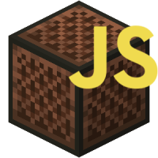

[Docs]: https://encode42.github.io/NBS.js/docs/
[Docs Badge]: https://img.shields.io/badge/Docs-3178C6?labelColor=3178C6&logo=typescript&logoColor=white&style=flat-square
[NPM]: https://www.npmjs.com/package/@encode42/nbs.js
[NPM Badge]: https://img.shields.io/npm/v/@encode42/nbs.js?label=​&color=cb0000&labelColor=cb0000&logo=npm&logoColor=white&style=flat-square
[Changelog]: changelog.md
[Changelog Badge]: https://img.shields.io/badge/Changelog-E05735?labelColor=E05735&logo=data:image/png;base64,iVBORw0KGgoAAAANSUhEUgAAACAAAAAgCAYAAABzenr0AAAAIGNIUk0AAHomAACAhAAA+gAAAIDoAAB1MAAA6mAAADqYAAAXcJy6UTwAAAAEZ0FNQQAAsY58+1GTAAAAAXNSR0IArs4c6QAAAAZiS0dEAP8A/wD/oL2nkwAAAAlwSFlzAAAOxAAADsQBlSsOGwAACKtJREFUeNrNV3twVFcZP9+5+yB7b0gI70AeC6GVRssMRctAsmFbSiutI2MBi9ampY5jxUJgKKWgdUAK2AePyj+IQEwp2iIEYoujkIZsAkWbKlheI49kkxAQSkqSfWR37z3H37mbYKABqTpjd+buOfc8vu87v/N9v++7jP2ff/TvFrS3VA3gMe0RLP2qJJFNjIZgOBXPecbkeWL8oCXNnX29/lP/UwMuXaoyPBHtRXR/gEVSMlbNiD5Ce4FLFhJMjiRiI5lk92HNQDzHsWylnuP7DRGJ/8qAjmDgLpK0EwJTsGCFx+XZTpnjIr2tlVJSR2PNBE3SLMnk0xg6C1Se03MLfv8fGRBtqPZajA6iWxlLuOb0HzW+3VZUV+cMD4wWMSnGMMbHYqQvriMIpUFJ7N3UHN+J0Ln9gxk5lwCpOTBss5HSuYCGPBi+bQOkrHKEg9qHGDztySmcqaCUx4+7wsaVEkA9H0sGoz2GXeqJMUku7PJhfDie/cTlz/Xsoor2YGAiSVZGTLYykXjEGDH5H7dlQCgYWAQr5up9Ou9UlkeaDg0TllmBZcMYE6/IBJWljvJdvlFI6FzNGMbZszCmGKhUJIh914o7LbczXgGfydI0h8+TNeH8LQ1ob97fn5uuIAyYY3iLfnXl9OG+EHAIU01xK/ZYxsgH2myULv5BD0c9hYzLAVJQs8XZ0fScwk/UXFtT9ShN0AZ0R0vBvmM4HH8OW+bbeB8pXJavb6b/4xsNcHR3uOVSDtSmX9G3q/c+zvgKWM90l+dRI9MXscMxob0S7mTfYiRduApctWQOycxQQyDASKw2sor24e4figRr4QfyjxHTnKmboekhp1HF49oOKd+eTDTT6mkA/5cDsO9DYhmNG5dQkEL+M8BnnvL+SH3teAg4BX15cLhvW5qjv5HrI71P1EB8TsbmBib53o6GQHnrmT+l6rmFL0mi57D2zZBTH0HS+gY05IWDQ1bfiICWDLvafDjMUuJ8/sq1W1qWlMx+HaZdMHJ8y1VIQsEBOOR6OOaT7vTcE6vXbo6qfcte3ZZYtX5rcOW60ooXFjxRTpIXOzSrePGiJ3b1zSqqWjJv9iBwxWLdbWywTCsgSW56Yd7sAPY0XIcAMQunYBf17IK6jjMHBwG+aRC2DnByOMlWzO3UcwqXwQipwjFaX5Urmw6l9DxJarb/GML2PqyPAa1SNaYzczGky3As/KLHW3AYiGyCiI0qsq43QFIBID+cxMR6VNGBJ9yvMtJYOxVXM1om2PPdG8IZkdEWafVh0/TdCKfiDNIcM9EtREQ9Tl5/J6JiEa52buRMdZbgjqWYy4gYV4qvMwDK7+CM6mxjiArQ7KX8/LgU4nuAZ1dvoXeznx1uRCuZYItsFMCIIKujQmML07ImtELeJih8XqFrG6CoVIWJZKIhaYwcj5H3FSlB0CQ43o7PnGCI3oCiu5TzJpWwUgzOUEo1Yf0CB/Z2NFVPtOc6zldmKENhR3MXMQwDrzdHgvxL6mqliNf1roTzUEPNmwjBaChYM7nnHHypBc0RQZZCkwnLUY5maLS+ZlyK168OWqMJPtM2ALHttDuaiLSe3ZeGrltyqxk0m4N+p+69/1KvSYiJn+J/Bk47w8gp3P/pJMXO4xllO2jeRCWj1SI2ogvlWqDgTxrgcNuhKC1nwinctncKycNIt250Y8rzb4L0PcChDNHxTm+TCB8wMo/2GPoYuWJw0vHofcWW6sA82sk7bKVkeow8S1GqcoqhuAvleGmypc7Tu36JdCufCtXXzOodIXYPMXGyx9AgKGlLXrNoVXa4uMfLu9JtVGPUj8hvqrSAJZkJK/6hsisUi36ld/20HjhvQAyXhs5VT+k5FamvuRdNdkJz2FejeANNOkjpb0mEtTS7FSLSHYYXwFJ5Xe71F4B+r518JFUCtq9fB63LUqFUiiTQouf65mPvq8Tpa91Ige81i+RadLalZ088q8YspimUmsGkR5IqRL6yM5WbjY4uzz8FK+7u0vEOnGQ+QubZcGPtyxjfDRJZ48krarLjfLhfRctTPWxaeg2U03vdkWDqdvClkWBinhqzHZtYCcJmzbVSTfIHcf5KRVTdCABuUrUdMznfgyYzGqwer7wbc78WDtrXGawZcavYV7CHnTq8W47lTmtqP6//quIYt+beDNmtujDXd6dsXNskGLPxWjrmRHuw+MfhxgNf1rMnfgAaLUMkrMDU/YbLMy8Sj5SZUp5EYtoCat0pLGpyUiJmMVc68ogirscQNUU4ZWncjJVk5D7QZldXjTW/VDKYJnyU5e9Mpn16GUc+qucWvXstG65ct/XCkpInpwGa4ejvWbrg6Q9wh6swFndnTQi8tHbLDvNqELHMp2PzQkTmDyVxwCqRwpm6z/fg4c8YXt/Gn73+Rqw9WFtgXqXdGB9DXEw1sif91c4jDdU/AhrFSNUPr1q39fJ1FVG4PjANJ/ktBI9JzSk43tFQjcxGv8PURoTqTwZ+oaAjKSQwVLGa1GRCZ84zlDUh2l20RgZEpuDKFuJ1EiS/BQosMbz+i10F7XIcaj44YJYnt7C815pQFRQIlUydOyYpwR0NB/wgky2YMmDMW4KJ9yRpl5wi0WxKnk0aOSWjfDjdOKx5WGU6+EA5Cb7MGFF4NFkvIkQ5fw0mKm75JmqMypsWpars0uIaEpE8GTPdjyuOUJ4ddqbOgeDpWDxWUfUN/ndF8T5OvhvFZ7nKhqqe7ONMTMeeuZj7IrRsE05rYW814ae/C0AayPfKQVIQHsv1lOiO7tpeGdPpSBnavTbucLfbKdZGr3o0eENBPwVCH1Lhj7bM1Kw1aVn+M5/py+jyqdrUlD5CfZbNSdYMEpTKT+B6/t4j2eD7UKJcZ3fgudMugBi7CoGVOPku3aXvvtnX1G1/nH5SX5XuJD4VjumDxrtVjsAzQKrEwphKuS3o1yP8jpEUH3lyfEdukbw+n79/AuKz7+M9sGzwAAAAAElFTkSuQmCC&logoColor=white&style=flat-square
[Demo]: https://encode42.github.io/NBS.js/demo/
[Demo Badge]: https://img.shields.io/badge/Demo-202b38?labelColor=202b38&logo=html5&logoColor=white&style=flat-square
[Actions]: https://github.com/Encode42/NBS.js/actions/workflows/build.yml
[Actions Badge]: https://img.shields.io/github/workflow/status/Encode42/NBS.js/Build?style=flat-square
[Support]: https://encode42.dev/support
[Support Badge]: https://img.shields.io/discord/646517284453613578?color=7289da&labelColor=7289da&label=​&logo=discord&logoColor=white&style=flat-square
[Codacy]: https://app.codacy.com/gh/Encode42/NBS.js/dashboard
[Codacy Badge]: https://img.shields.io/codacy/grade/68f12c67186549b88ab7ada56ac83efc?color=172B4D&labelColor=172B4D&label=​&logo=codacy&style=flat-square


<div align="right">

# NBS.js
### A versatile API for reading, manipulating, and writing [OpenNBS](https://opennbs.org) files, heavily inspired by [NBSEditor](https://github.com/TheGreatFoxxy/NBSEditor/blob/408e3e58058bd72286fc7e9740d62a39a0c919dd/src/NBS.js) and [NoteBlockAPI](https://github.com/koca2000/NoteBlockAPI).

[![Docs Badge]][Docs] [![Changelog Badge]][Changelog] [![NPM Badge]][NPM]  
[![][Actions Badge]][Actions] [![][Codacy Badge]][Codacy] [![][Support Badge]][Support]
</div>

### 🔧 Including
🌐 **Browser**

> It's recommended to use a versioned link, e.g. `@encode42/nbs.js@2.1.0`

Script
```html
<script src="https://cdn.jsdelivr.net/npm/@encode42/nbs.js"></script>
```
<sub>Minified: https://cdn.jsdelivr.net/npm/@encode42/nbs.js/dist/umd.min.js</sub>

Module
```js
import { Song } from "https://cdn.jsdelivr.net/npm/@encode42/nbs.js/dist/esm.js";
```
<sub>Minified: https://cdn.jsdelivr.net/npm/@encode42/nbs.js/dist/esm.min.js</sub>

⚙️ **Deno**
```js
import { Song } from "https://cdn.jsdelivr.net/npm/@encode42/nbs.js/dist/esm.js";
```

⚙️ **Node.js**

NPM
```sh
npm i @encode42/nbs.js
```

Yarn
```sh
yarn add @encode42/nbs.js
```

### ❔ FAQ
<details>
<summary>
<b>How do I use this?</b>
</summary>

[Install NBS.js for your platform](#-including), then refer to the [documentation][Docs] and examples below.

[![Docs Badge]][Docs]

<details>
<summary>
Browser (Script)
</summary>

```html
<input type="file" id="file-input">

<script src="https://cdn.jsdelivr.net/npm/@encode42/nbs.js"></script> <!-- Import NBS.js -->
<script>
window.addEventListener("load", () => {
  const input = document.getElementById("file-input");

  // Clear the file input (QOL)
  input.value = null;

  // Initialize file input
  input.addEventListener("change", () => {
    const songFile = input.files[0]; // Read a NBS file
    songFile.arrayBuffer().then(buffer => { // Create an ArrayBuffer
      const song = NBSjs.fromArrayBuffer(buffer); // Parse song from ArrayBuffer

      console.log(song);
    });
  });
});
</script>
```
</details>

<details>
<summary>
Browser (Module)
</summary>

index.html
```html
<input type="file" id="file-input">

<script src="index.js" type="module">
```

index.js
```js
import { fromArrayBuffer } from "https://cdn.jsdelivr.net/npm/@encode42/nbs.js/dist/esm.js"

window.addEventListener("load", () => {
  const input = document.getElementById("file-input");

  // Clear the file input (QOL)
  input.value = null;
    
  // Initialize file input
  input.addEventListener("change", () => {
    const songFile = input.files[0]; // Read a NBS file
    songFile.arrayBuffer().then(buffer => { // Create an ArrayBuffer
      const song = fromArrayBuffer(buffer); // Parse song from ArrayBuffer

      console.log(song);
    });
  });
});
```
</details>

<details>
<summary>
Deno
</summary>

```js
import { fromArrayBuffer } from "https://cdn.jsdelivr.net/npm/@encode42/nbs.js/dist/esm.js";

const songFile = await Deno.readFile("song.nbs"); // Read a NBS file
const buffer = new Uint8Array(songFile).buffer; // Create an ArrayBuffer
const song = fromArrayBuffer(buffer); // Parse song from ArrayBuffer

console.log(song);
```
</details>

<details>
<summary>
Node.js
</summary>

```js
const fs = require("fs");
const { fromArrayBuffer } = require("@encode42/nbs.js"); // Import NBS.js

const songFile = fs.readFileSync("song.nbs"); // Read a NBS file
const buffer = new Uint8Array(songFile).buffer; // Create an ArrayBuffer
const song = fromArrayBuffer(buffer); // Parse song from ArrayBuffer

console.log(song);
```

[![NPM Badge]][NPM]
</details>
</details>

<details>
<summary>
<b>Is there a demo?</b>
</summary>

~~Yes! A GitHub pages site is located [here](https://encode42.github.io/NBS.js/demo/). It contains a demonstration of how to read and process NBS files, displays the song structure, and plays the song through the browser.~~

The demo is currently under development. Check [NBSPlayer](https://github.com/Encode42/NBSPlayer) for a working example!

<!-- [![Demo Badge]][Demo] -->
</details>

<details>
<summary>
<b>Where's the changelog?</b>
</summary>

I don't create GitHub releases, but I do keep a changelog [here][Changelog]!

[![Changelog Badge]][Changelog]
</details>

### 🔨 Building
Ensure [Yarn](https://yarnpkg.com/) and [Node.js](https://nodejs.org/en/) are installed.

1. Enter the directory containing the NBS.js source code in your terminal.
2. Install the build dependencies via `yarn install`.
3. Run `yarn run build` to generate the Node.js and browser modules.

Generated files:
- `dist/cjs.js`: CommonJS bundle, used by Node.js.
- `dist/esm.js`: ES module for browser script modules.
- `dist/umd.js`: UMD bundle for browser scripts.
- `dist/*.min.js`: Minified bundle.
- `build/`: Built ESNext JS files from TS.
